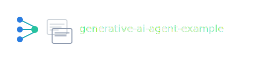

# Generative AI Agent Example



Minimal **AI Agent** example using **Ollama** locally to fetch Hogwarts spells from a dedicated API.  
Educational project for Python developers wanting to build generative agents with minimal dependencies (only ollama, python-dotenv, requests).

[](https://raw.githubusercontent.com/carmelolg/generative-ai-agent-example/master/static/hogwarts-expert-on-fire.mov)

## Key Features

- **ReAct Agent with Ollama**: uses qwen3:latest and nomic-embed-text:latest for reasoning and tool calling.
- **Two specific tools**: get_spell_name() for exact spells, get_spell_use() for the spell's use.
- **Zero external dependencies**: only ollama==0.6.1, python-dotenv==1.2.1, requests.
- **Works offline**: local Ollama models, Hogwarts API requires internet only for queries.
- **Robust error handling**: fallback for failed APIs or spells not found.
- **Verbose tracing**: shows agent's reasoning and tool calls process.

## Prerequisites

- **Python 3.10+**
- **Ollama** installed and running (`ollama serve`)
- Ollama models: `ollama pull qwen3:latest` and `ollama pull nomic-embed-text:latest`
- `.env` file with `HOGWARTS_API_HOST=https://potterapi-fedeperin.vercel.app`

```bash
ollama pull qwen3:latest
ollama pull nomic-embed-text:latest
```

## Installation

```bash
git clone https://github.com/carmelolg/generative-ai-agent-example.git
cd generative-ai-agent-example
python -m venv .venv
source .venv/bin/activate  # On Windows: .venv\Scripts\activate
pip install -r requirements.txt
```

Create the `.env` file with the variables listed in prerequisites.

## Configuration

Edit `.env` to customize:

```
EMBEDDING_MODEL=nomic-embed-text:latest
LANGUAGE_MODEL=qwen3:latest
HOGWARTS_API_HOST=https://potterapi-fedeperin.vercel.app
HOGWARTS_API_LANG=en
HOGWARTS_API_SPELLS_PATH=spells
```

## Running the Agent

Start the interactive agent:

```bash
python hogwarts-agent-chat.py # Command line chat interface
# OR
python hogwarts-gui-chat.py # GUI chat interface available on http://localhost:8080
```
The agent will reason step-by-step, call necessary tools, and return the response.

## Running on Docker    
Create this shell script:
```shell
#!/bin/bash
docker build . -t carmelolg/hogwarts-gui-chat
docker run -d -p8080:8080 carmelolg/hogwarts-gui-chat
```

run on the terminal the following commands:
```shell
chmod +x [NAME_OF_YOUR_SCRIPT].sh
./[NAME_OF_YOUR_SCRIPT].sh
```

## Usage Examples

**Specific spell query**:

```
Input: "Describe Wingardium Leviosa"
Output: The use of the spell **Wingardium Leviosa** is to levitate objects.
```

**Exploratory search**:

```
Input: "What spells are used for turn on a light?"
Output: The spell to turn on a light is **Lumos**.
```

## Project Architecture

```
├── lib                                  
│   ├── service                  
│   │   ├── HogwartsHttpService.py      # HTTP calls to Hogwarts API
│   │   └── KnowledgeService.py         # Spell search and retrieval tools
│   ├── tool                     
│   │   └── HogwartsSpellTools.py       # Spell-specific tools implementations
│   ├── utils                     
│   │   ├── EnvironmentVariables.py     # Singleton for access to env variables
│   │   ├── MathUils.py                 # Math helper functions (if needed)
│   │   ├── OllamaUtils.py              # Ollama model interaction helpers
│   │   └── PromptUtils.py              # Prompt message utilities
├── .env                                # Environment variables
├── hogwarts-agent.py                   # the main agent logic
├── hogwarts-agent-chat.py              # the charbot that use agent logic
├── README.md                           # Repository docs
├── LICENSE.md                          # License distribution refs
└── requirements.txt                    # Minimal dependencies
```

- **OllamaLLM + Embeddings**: local models for reasoning and context.
- **Custom tools**: pure HTTP calls with docstrings for tool calling.
- **AgentExecutor**: handles reasoning-action-observation loop.

## Recommended Extensions

- Add tools for potions/wands from Hogwarts API.
- Change model: update `LANGUAGE_MODEL` in `.env`.
- Change model: update `EMBEDDING_MODEL` in `.env`.
- Integrate RAG: use embeddings for local documents.
- Deploy: wrap in FastAPI for API endpoints.
- Multi-tool: expand with calculator or file I/O.


# License


This project is licensed under the **Creative Commons Attribution-NonCommercial-NoDerivatives 4.0 International (CC BY-NC-ND 4.0)**. 

See `LICENSE.md` for the full license text.
